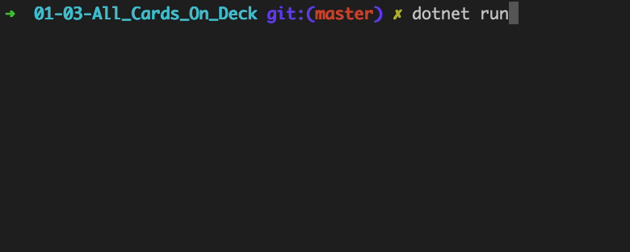

# 01-03 All Cards on Deck



# Assignment Overview:

In this project, you will use C# to model [a deck of playing cards](https://en.wikipedia.org/wiki/standard_52-card_deck). You'll also add functionality such as shuffling and dealing.

### Shuffling Cards

As we have seen, computers do _exactly_ what we tell them to do. Thus, computers are bad at generating truly random numbers. Randomness is a deep and complex topic, but it's worth pointing out that most random numbers we use in computing are what we call "[pseudorandom](https://en.wikipedia.org/wiki/pseudorandomness)". That is, they generate numbers that appear to be random such that _guessing_ the next random number the computer's fixed algorithm is going to generate is very difficult. This makes it _good enough_ for most purposes. For this assignment, you will read about, then implement, a popular algorithm that shuffles the order of a finite set using C#'s built-in `Random.Next()` function as a pseudorandom number generator.

## Objectives

- Demonstrate usage of arrays to model resources.
- Understand and implement algorithms.
- Understand loops.

## Requirements

- Your deck should contain 52 unique cards.
- All cards should be represented as as string such as "Ace of Hearts"
- There are four suits: "Clubs", "Diamonds", "Hearts", and "Spades".
- There are 13 ranks: "Ace", "2", "3", "4", "5", "6", "7", "8", "9", "10",
  "Jack", "Queen", and "King".

You will model these in code, in any way you see fit. It may require you to experiment and try several techniques. There are _many_ valid solutions.

> NOTE: The more you plan this out (focus on the _algorithm_) the better you will do.

To shuffle the cards, you should implement the [Fisher–Yates shuffle](https://en.wikipedia.org/wiki/Fisher%E2%80%93Yates_shuffle) algorithm. The shuffling algorithm starts with the last element in our collection (in our case a deck of cards) and swaps it with a randomly selected element that comes before it. This continues downward through the elements towards the first element. Watch the first few minutes [of this video](https://www.youtube.com/watch?v=tLxBwSL3lPQ) for a visual description of the algorithm.

If we were going to write an _algorithm_ for this we would write something like:

```
make n = 52 since we are dealing with 52 elements

for firstIndex from n - 1 down to 1 do:
  secondIndex = random integer that is greater than or equal to 0 and LESS than firstIndex

  Now swap the values at firstIndex and secondIndex by doing this:
    firstValue = the value from items[firstIndex]
    secondValue = the value from items[secondIndex]
    items[firstIndex] = secondValue
    items[secondIndex] = firstValue
```

_hint:_ understand the algorithm before you try to implement it.

### Explorer Mode

- [x] Once the program starts, you should create a new deck.
- [x] After deck creation, you should shuffle the deck.
- [x] After the deck is shuffled, display the top two cards.

## Adventure Mode

- [x] In addition to displaying the top two cards, also store these two "dealt" cards in a variable named `playerHand`. Consider what _type_ of variable `playerHand` will have to be.
- [x] Implement a way to deal cards into two _different_ hands.

## Epic Mode

- [ ] Implement the game of [War][1]

[1]: https://en.wikipedia.org/wiki/War_(card_game)

## Resources

- [List](https://docs.microsoft.com/en-us/dotnet/api/system.collections.generic.list-1?view=netcore-3.1)
